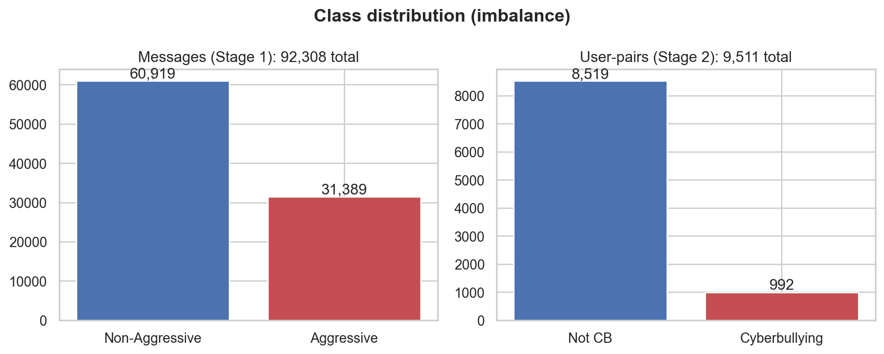
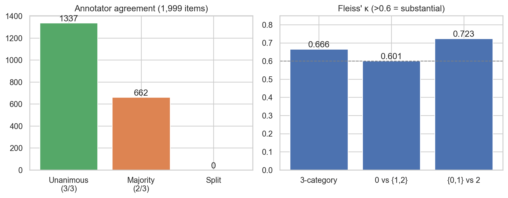
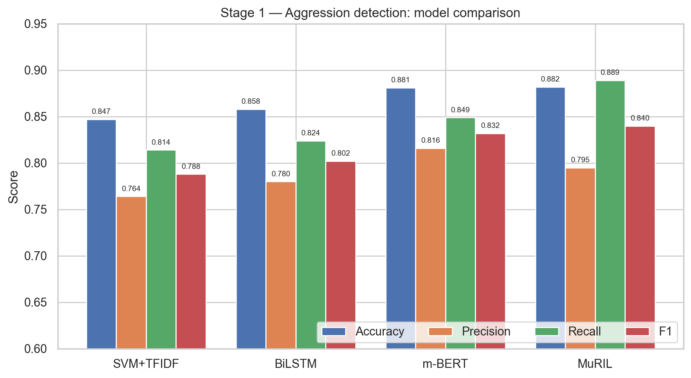
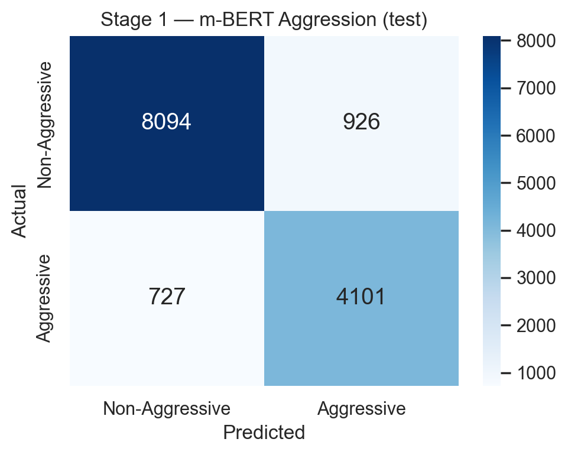
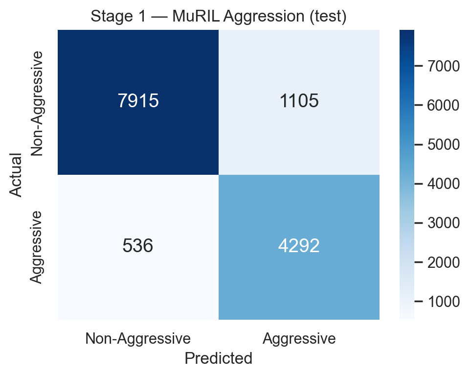
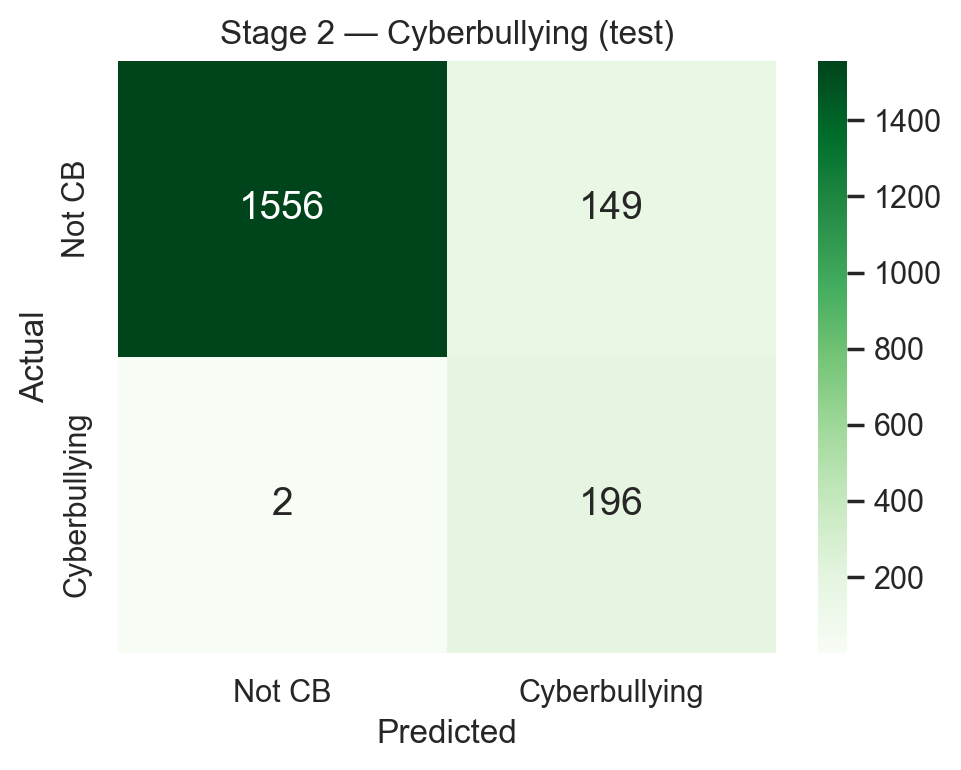
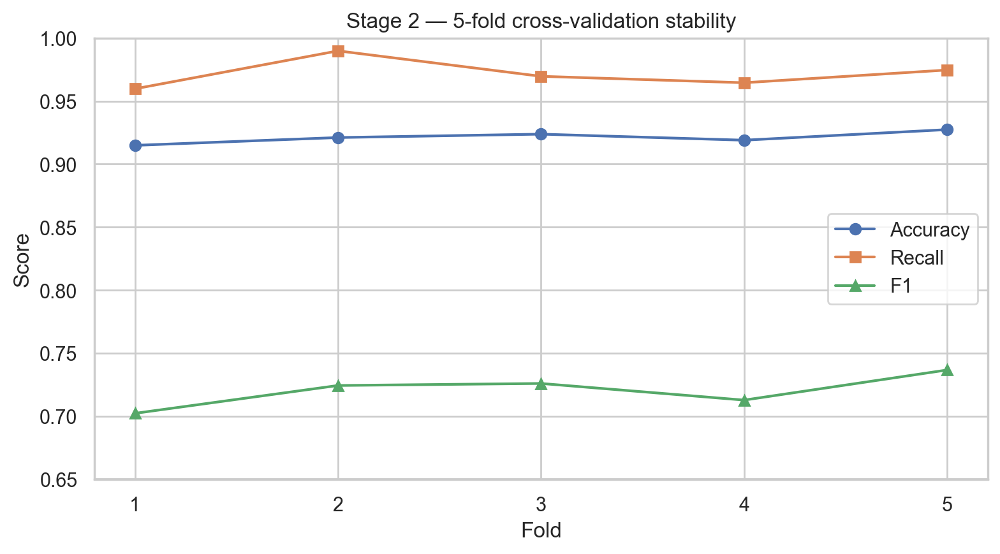
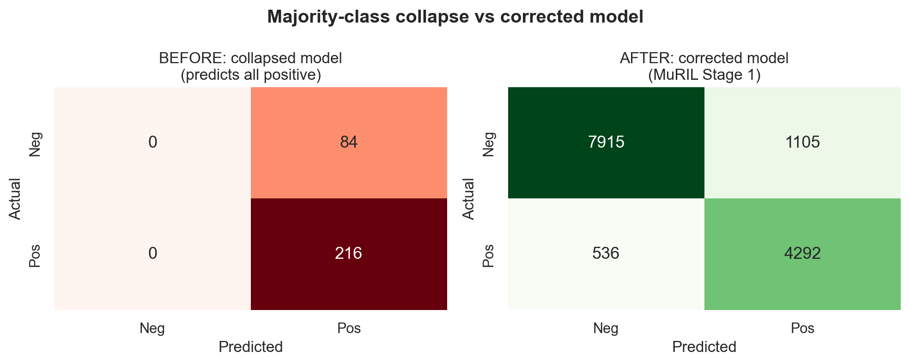

# CHAPTER 4

# RESULTS AND DISCUSSION

## 4.1 Introduction

This chapter presents the experimental results of the proposed two-stage
cyberbullying detection framework. It begins with the statistics of the prepared
dataset and the reliability of its annotations, then reports the performance of
**Stage 1** (message-level aggression detection) and **Stage 2** (relationship-level
cyberbullying classification), comparing the multilingual transformers against
classical and deep-learning baselines. A separate section documents and analyses the
**majority-class-collapse** failure of an earlier model, providing an instructive
contrast with the corrected design. The chapter closes with a discussion of the
findings in relation to the research questions and the existing literature. All
reported numbers are reproducible with a fixed random seed (42) and are backed by the
saved evaluation reports in the project's `models/` directory.

## 4.2 Dataset Statistics and Class Distribution

The dataset was organised into the two views described in Chapter 3. **Table 4.1**
summarises their size and class balance, and **Figure 4.1** visualises the
distributions. Two characteristics stand out and shape the rest of the analysis.
First, the message-level data is **multilingual but English-dominant** (90,356
English and 1,952 Roman Urdu messages). Second, both views are **imbalanced** — only
34.0% of messages are aggressive, and only 10.4% of user-pairs are cyberbullying —
which makes accuracy alone an unreliable metric and motivates the class-weighting and
recall-focused evaluation used throughout.

**Table 4.1.** Dataset statistics and class distribution.

| View | Size | Positives | Composition |
|---|---:|---|---|
| Messages (Stage 1) | 92,308 | 31,389 aggressive (34.0%) | 90,356 English + 1,952 Roman Urdu |
| User-pairs (Stage 2) | 9,511 | 992 cyberbullying (10.4%) | from 100 users' conversation history |

> **Figure 4.1.** Class distribution of the message-level data (aggressive vs
> non-aggressive) and the pair-level data (cyberbullying vs not). Both views are
> imbalanced toward the negative class.

## 4.3 Inter-Annotator Agreement Results

The reliability of the Roman Urdu annotations was assessed with **Fleiss' Kappa**
over 1,999 items labelled by three annotators on a three-level scale. As shown in
**Table 4.2** and **Figure 4.2**, the three-category agreement is **κ = 0.666**,
which falls in the **"substantial agreement"** band on the standard interpretation
scale; binarising the scale in either direction yields κ values of 0.60–0.72, also
substantial. Of the 1,999 items, 1,337 were labelled unanimously by all three
annotators and 662 by a two-thirds majority, with none fully split. This confirms
that the labels driving the model are consistent and trustworthy rather than
arbitrary.

**Table 4.2.** Inter-annotator agreement (Fleiss' Kappa), Roman Urdu data, 3
annotators, 1,999 items.

| Scheme | Fleiss' κ | Interpretation |
|---|---:|---|
| 3-category (0 / 1 / 2) | **0.666** | Substantial |
| Binary: 0 vs {1, 2} | 0.601 | Substantial |
| Binary: {0, 1} vs 2 | 0.723 | Substantial |

> **Figure 4.2.** Inter-annotator agreement: distribution of unanimous versus
> majority annotations and the Fleiss' Kappa value across labelling schemes.

## 4.4 Stage 1 — Aggression Detection Results

Stage 1 was evaluated on a held-out test set of 13,848 messages. **Table 4.3**
reports the results for the two multilingual transformers (m-BERT and MuRIL) against
a classical **SVM + TF-IDF** baseline and a **BiLSTM** baseline; **Figure 4.3**
presents the same comparison graphically. (The reported models were trained on the
dataset prior to a minor correction of the Roman Urdu labels — affecting under 1% of
all messages — described in Section 3.4.1; re-training on the corrected labels is
expected to leave these results essentially unchanged, as the English data, which
constitutes 97.9% of the corpus, is unaffected.)

**Table 4.3.** Stage 1 message-level aggression results (held-out test, n = 13,848).

| Model | Accuracy | Precision | Recall | F1 |
|---|---:|---:|---:|---:|
| SVM + TF-IDF (baseline) | 0.847 | 0.763 | 0.812 | 0.788 |
| BiLSTM (baseline) | 0.858 | 0.780 | 0.824 | 0.802 |
| m-BERT | 0.881 | **0.816** | 0.849 | 0.832 |
| **MuRIL** | **0.882** | 0.795 | **0.889** | **0.840** |

> **Figure 4.3.** Stage 1 model comparison across accuracy, precision, recall and
> F1-score for the SVM, BiLSTM, m-BERT and MuRIL models.

The results show a clean, monotonic progression — **SVM < BiLSTM < m-BERT < MuRIL** —
that exactly matches the narrative of Chapter 2: classical machine learning is
improved upon by older deep learning, which is in turn surpassed by transformer
models. Both transformers beat the classical baseline by a clear margin.

**MuRIL is the best model overall**, with the highest accuracy (0.882), the highest
F1-score (0.840) and, most importantly for a safety task, the highest **recall**
(0.889 versus m-BERT's 0.849). The confusion matrices in **Figure 4.4** and **Figure
4.5** make this concrete: MuRIL reduces the number of *missed* aggressive messages
(false negatives) from 727 to 536. This advantage is consistent with MuRIL's
pretraining on South Asian and transliterated text, which is well matched to Roman
Urdu. In a cyberbullying setting, where the cost of missing genuine aggression is
high, MuRIL's recall-favouring behaviour is the preferable trade-off. This answers
**RQ1**: a multilingual transformer reliably detects aggression across English and
Roman Urdu, and MuRIL outperforms m-BERT.

> **Figure 4.4.** Confusion matrix — m-BERT aggression classifier (TN = 8094, FP =
> 926, FN = 727, TP = 4101).

> **Figure 4.5.** Confusion matrix — MuRIL aggression classifier (TN = 7915, FP =
> 1105, FN = 536, TP = 4292). MuRIL misses fewer aggressive messages than m-BERT.

## 4.5 Stage 2 — Cyberbullying Classification Results

Stage 2 takes each user-pair's aggregated behavioural features — aggression
proportion, repetition, intent, peerness and user context — and predicts the final
cyberbullying label. To ensure the result is not an artefact of a single fortunate
split, it was evaluated both with **5-fold stratified cross-validation** (the
headline figure) and on a held-out test set. **Table 4.4** reports both, and
**Figure 4.6** and **Figure 4.7** show the test confusion matrix and the per-fold
cross-validation scores.

**Table 4.4.** Stage 2 user-pair cyberbullying results.

| Evaluation | Accuracy | Precision | Recall | F1 |
|---|---:|---:|---:|---:|
| 5-fold CV (mean ± std) | 0.921 ± 0.004 | 0.572 ± 0.013 | 0.972 ± 0.010 | 0.720 ± 0.012 |
| Held-out test (n = 1,903) | 0.921 | 0.568 | 0.990 | 0.722 |

> **Figure 4.6.** Confusion matrix — Stage 2 cyberbullying classifier on the held-out
> test set (TN = 1556, FP = 149, FN = 2, TP = 196).

> **Figure 4.7.** Stage 2 performance across the five cross-validation folds. The very
> small variance (± 0.4% accuracy) shows the result is stable rather than a lucky
> split.

The model achieves **92.1% accuracy** with an exceptionally high **recall of 0.972
(cross-validation) and 0.990 (test)**: on the test set it correctly identifies **196
of 198** true cyberbullying pairs, missing only two. The very low cross-validation
standard deviation (± 0.4% accuracy) confirms that this performance is **stable**, not
the product of a favourable split. Precision is deliberately lower (≈ 0.57) because,
on a 10.4%-positive, safety-critical task, the model is tuned through positive-class
weighting to **favour recall** — it is far more costly to miss a genuine victim than
to raise a false alarm that can be reviewed. This directly addresses **RQ2** and
**RQ3**: separating message-level aggression from relationship-level cyberbullying,
and combining the aggression signal with repetition, intent and peerness, recovers the
behavioural definition of cyberbullying that a single-stage aggression classifier
cannot.

## 4.6 The "Before" Story: Diagnosing Majority-Class Collapse

A central methodological lesson of this project is the contrast between a model that
*appears* to work and one that genuinely does. An earlier, single-stage, multi-label
model suffered a **majority-class collapse**: it learned to predict the dominant class
for every input. Its aggression confusion matrix was `[[0, 84], [0, 216]]` — it
labelled **every** message as positive — yielding a superficially respectable **72%
"accuracy"** (simply the base rate of the majority class) while detecting nothing of
value. The repetition and intent outputs were worse still: with no positive examples
available at the message level, those labels were unlearnable.

Two root causes were identified: (i) **class imbalance with no correction**, which let
the model minimise loss by ignoring the minority class; and (ii) attempting to predict
**repetition and intent at the single-message level**, where they are not defined.
The fixes were precisely the design decisions described in Chapter 3: **class
weighting**, evaluation by **recall and F1 rather than accuracy**, and the **two-stage,
relationship-level architecture** that moves repetition and intent to the level at
which they actually exist. **Table 4.5** and **Figure 4.8** contrast the two models.

**Table 4.5.** The earlier collapsed model versus the corrected two-stage model
(aggression task).

| Model | Accuracy | Recall (bullying) | Genuine detection? |
|---|---:|---:|---|
| Earlier single-stage (collapsed) | 0.72 | 1.00 (predicts all positive) | No — detects nothing meaningful |
| Corrected Stage 1 (MuRIL) | 0.882 | 0.889 | Yes |

> **Figure 4.8.** Confusion matrices of the earlier collapsed model (left) versus the
> corrected model (right). The collapsed model predicts a single class for every
> input; the corrected model discriminates genuinely between classes.

This experience answers **RQ4** and carries a wider message: on imbalanced,
safety-critical detection tasks, headline accuracy can be actively misleading, and
correct metric selection and problem framing are as important as the choice of model.

## 4.7 Multimodal Image-and-Text Component (Stage 3)

The multimodal component (Section 3.12) was trained and evaluated on the **Memotion**
meme dataset of 6,992 memes (4,279 offensive / 2,713 non-offensive), where each sample
comprises a meme image and its overlaid text. Unlike the conversational dataset, this
benchmark is **positive-heavy** (about 61% offensive), and offensive memes are a
recognised hard case in the literature, where state-of-the-art systems achieve only a
macro-F1 of around 0.50.

> *(Optional: insert 2–3 real sample memes here — image plus its OCR text and label —
> taken from `data/processed/memes.csv`, as a figure or short table.)*

The multimodal classifier (ResNet50 + m-BERT fusion) reached a test accuracy of **0.54**,
with precision 0.62, recall 0.65 and an F1 of 0.64 on the offensive class, but a
**macro-F1 of only 0.51** — essentially at the level of the majority-class baseline. The
model also showed a strong tendency to **overfit** (training accuracy rose to 0.96 while
validation accuracy stagnated near 0.54) and, under alternative training settings,
collapsed toward predicting the majority class — *the same failure mode documented for the
text model in Section 4.6*. These results indicate that, on this benchmark and with this
data, the **image modality did not yield a reliable cyberbullying signal**: the offensive
label is a weak proxy for bullying, the bullying cue in a meme lies largely in its text
rather than its image, and the dataset is too small to fine-tune two large pretrained
backbones without overfitting.

This component is therefore reported as a **preliminary, exploratory result rather than a
validated contribution**. It establishes a working multimodal pipeline and an honest
baseline, while the directions needed to make image-based detection reliable — a larger,
purpose-built bullying image dataset, frozen-backbone or lightweight fusion, balanced
sampling and macro-averaged model selection — are set out as future work (Section 5.4).
The **two-stage text system remains the validated core contribution** of this thesis.

## 4.8 Discussion

Taken together, the results support the central thesis of this work: **cyberbullying is
best modelled as a behaviour over a relationship, not as a property of a single
message**. Stage 1 establishes that aggression can be detected reliably and
multilingually, with MuRIL the strongest model; Stage 2 demonstrates that layering
repetition, intent and peerness on top of that aggression signal yields a stable,
high-recall cyberbullying decision. The two stages are complementary: Stage 1 supplies
the linguistic signal, and Stage 2 supplies the behavioural context that turns
aggression into a cyberbullying judgement.

The deliberate emphasis on **recall** throughout is a considered design choice rather
than an accident of tuning. In a protective system, a missed case of sustained
harassment is a far more serious outcome than a false alarm, and both stages are
configured accordingly. The lower precision at Stage 2 is the acknowledged cost of this
choice, and is appropriate when flagged cases are intended for human review rather than
automatic punishment.

## 4.9 Comparison with Existing Literature

**Table 4.6** positions the proposed system against representative prior work. The key
distinction is not raw accuracy — which is not directly comparable across different
datasets — but **scope**. Most prior systems, including the recent Roman Urdu and
multilingual studies, detect **aggression only** and equate it with cyberbullying. The
proposed framework is, to the author's knowledge, distinctive in combining
**multilingual aggression detection** with explicit, quantitative modelling of
**repetition, intent and peerness**, thereby operationalising the full behavioural
definition of cyberbullying rather than a single facet of it.

**Table 4.6.** Comparison of the proposed system with representative existing work.

| Work | Languages | Aggression | Repetition | Intent | Peerness | Approach |
|---|---|:---:|:---:|:---:|:---:|---|
| Dewani et al.; Anwar & Anwar; Rasheed et al. | Roman Urdu | ✓ | ✗ | ✗ | ✗ | NLP / deep learning |
| Pawar (2019) | English, Hindi, Marathi | ✓ | ✗ | ✗ | ✗ | ML + lexicon, distributed |
| Razi & Ejaz (2024) | Urdu, Roman Urdu, English | ✓ | ✗ | ✗ | ✗ | Multilingual model |
| **This work** | English, Roman Urdu (Urdu) | ✓ | ✓ | ✓ | ✓ | Two-stage transformer + behavioural |

In summary, the experimental evidence confirms all four research questions: a
multilingual transformer detects aggression effectively (RQ1); a two-stage design
recovers repetition and intent that single-stage models miss (RQ2); repetition, intent
and peerness can be quantified and meaningfully combined (RQ3); and correcting the
majority-class collapse demonstrates the decisive importance of imbalance-aware
evaluation (RQ4).
