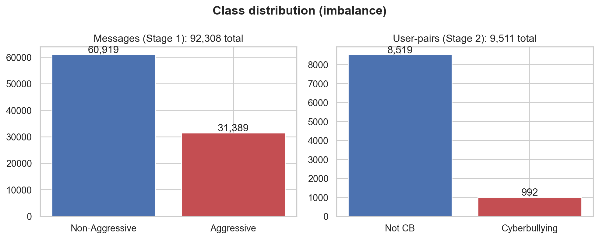
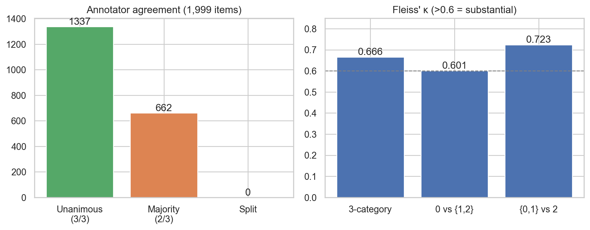
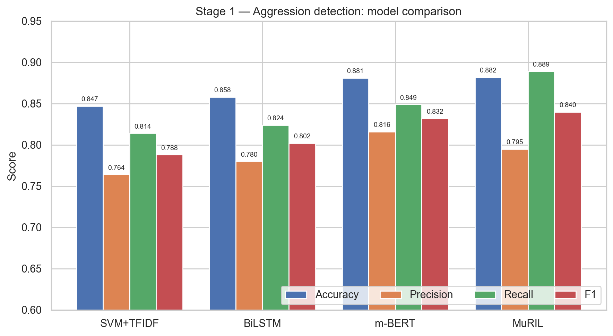
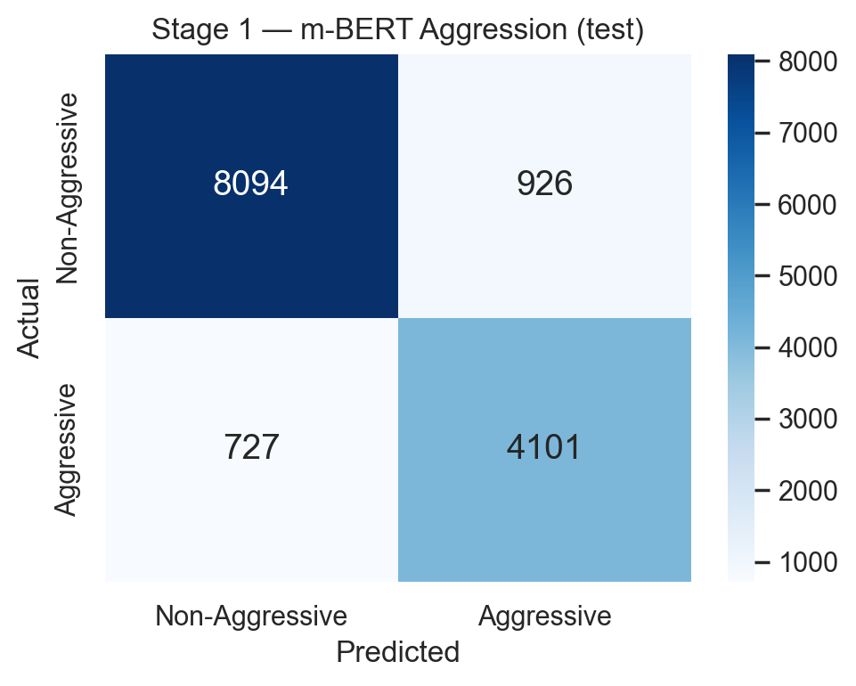
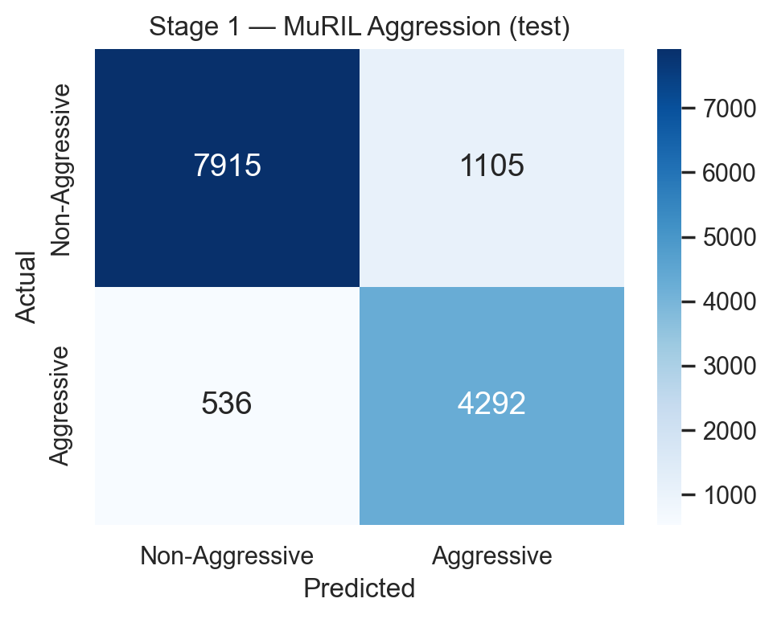
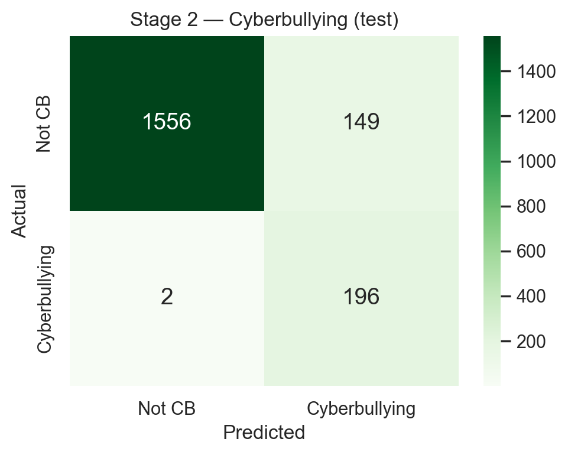
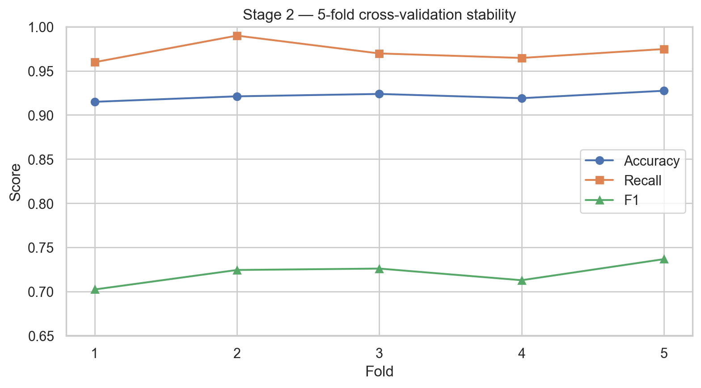
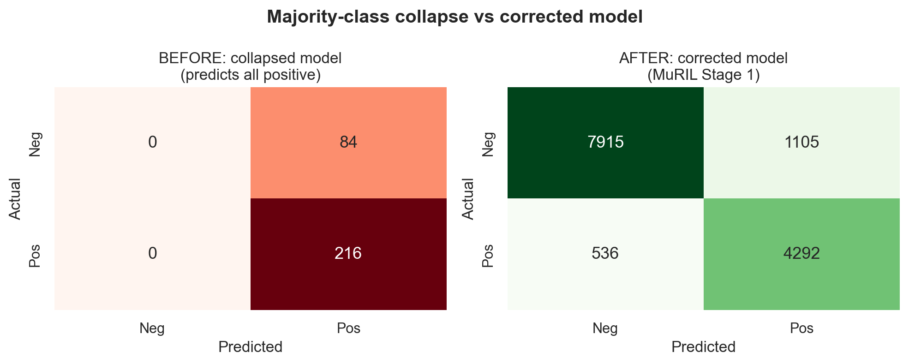

# CHAPTER 4

# RESULTS AND DISCUSSION

## 4.1 Introduction

This chapter reports what the two-stage system actually did. It starts with the dataset
statistics and how reliable the labels are, then gives the numbers for **Stage 1**
(message-level aggression) and **Stage 2** (relationship-level cyberbullying), each set against
classical and deep-learning baselines. A separate section digs into the **majority-class
collapse** of an earlier model, because the contrast is instructive. The chapter ends by
discussing the findings against the research questions and the wider literature. Every number
here is reproducible with a fixed seed (42) and is backed by the saved reports in the project's
`models/` folder.

## 4.2 Dataset Statistics and Class Distribution

The data was split into the two views from Chapter 3. **Table 4.1** gives their size and class
balance, and **Figure 4.1** shows the distributions. Two things stand out and colour everything
that follows. The message-level data is **multilingual but heavily English** (90,356 English to
1,952 Roman Urdu). And both views are **imbalanced** — only 34.0% of messages are aggressive, and
only 10.4% of user-pairs are cyberbullying. That is why accuracy alone would mislead, and why
class weighting and a focus on recall run through the whole evaluation.

**Table 4.1.** Dataset statistics and class distribution.

| View | Size | Positives | Composition |
|---|---:|---|---|
| Messages (Stage 1) | 92,308 | 31,389 aggressive (34.0%) | 90,356 English + 1,952 Roman Urdu |
| User-pairs (Stage 2) | 9,511 | 992 cyberbullying (10.4%) | from 100 users' conversation history |

> **Figure 4.1.** Class distribution of the messages (aggressive vs non-aggressive) and the pairs
> (cyberbullying vs not). Both lean toward the negative class.

## 4.3 Inter-Annotator Agreement Results

The Roman Urdu labels were checked with **Fleiss' Kappa** over 1,999 items rated by three
annotators on a three-level scale. As **Table 4.2** and **Figure 4.2** show, the three-category
agreement is **κ = 0.666**, which sits in the **"substantial agreement"** band; collapsing the
scale to two categories either way gives κ between 0.60 and 0.72, still substantial. Of the 1,999
items, all three annotators agreed on 1,337, two of three agreed on 662, and none were a
three-way split. So the labels behind the model are consistent, not arbitrary.

**Table 4.2.** Inter-annotator agreement (Fleiss' Kappa), Roman Urdu data, 3 annotators, 1,999
items.

| Scheme | Fleiss' κ | Interpretation |
|---|---:|---|
| 3-category (0 / 1 / 2) | **0.666** | Substantial |
| Binary: 0 vs {1, 2} | 0.601 | Substantial |
| Binary: {0, 1} vs 2 | 0.723 | Substantial |

> **Figure 4.2.** Inter-annotator agreement: unanimous versus majority labels, and the Fleiss'
> Kappa value across labelling schemes.

## 4.4 Stage 1 — Aggression Detection Results

Stage 1 was tested on a held-out set of 13,848 messages. **Table 4.3** gives the two multilingual
transformers (m-BERT and MuRIL) alongside a classical **SVM + TF-IDF** and a **BiLSTM** baseline,
and **Figure 4.3** shows the same comparison. (These models were trained before a small correction
to the Roman Urdu labels — under 1% of all messages, described in Section 3.4.1. Re-training on the
corrected labels should barely move the numbers, since the English data, 97.9% of the corpus, is
untouched.)

**Table 4.3.** Stage 1 message-level aggression results (held-out test, n = 13,848).

| Model | Accuracy | Precision | Recall | F1 |
|---|---:|---:|---:|---:|
| SVM + TF-IDF (baseline) | 0.847 | 0.763 | 0.812 | 0.788 |
| BiLSTM (baseline) | 0.858 | 0.780 | 0.824 | 0.802 |
| m-BERT | 0.881 | **0.816** | 0.849 | 0.832 |
| **MuRIL** | **0.882** | 0.795 | **0.889** | **0.840** |

> **Figure 4.3.** Stage 1 comparison across accuracy, precision, recall and F1 for SVM, BiLSTM,
> m-BERT and MuRIL.

The ordering is clean: **SVM < BiLSTM < m-BERT < MuRIL**. That is exactly the story Chapter 2 told
— classical machine learning improved on by older deep learning, then overtaken by transformers —
and both transformers clear the classical baseline comfortably.

**MuRIL comes out on top.** It has the best accuracy (0.882), the best F1 (0.840), and — the one
that matters most for a safety task — the best **recall** (0.889 against m-BERT's 0.849). The
confusion matrices in **Figure 4.4** and **Figure 4.5** make it concrete: MuRIL cuts the number of
*missed* aggressive messages from 727 down to 536. That fits MuRIL's pretraining on South Asian and
transliterated text, which lines up with Roman Urdu. When missing real aggression is the expensive
mistake, MuRIL's lean toward recall is the trade-off you want. This answers **RQ1**: a multilingual
transformer detects aggression reliably across English and Roman Urdu, and MuRIL edges out m-BERT.

> **Figure 4.4.** Confusion matrix — m-BERT (TN = 8094, FP = 926, FN = 727, TP = 4101).

> **Figure 4.5.** Confusion matrix — MuRIL (TN = 7915, FP = 1105, FN = 536, TP = 4292). It misses
> fewer aggressive messages than m-BERT.

## 4.5 Stage 2 — Cyberbullying Classification Results

Stage 2 takes each pair's aggregated features — aggression proportion, repetition, intent, peerness
and user context — and predicts the final label. To make sure the result was not a lucky split, it
was evaluated both with **5-fold stratified cross-validation** (the headline) and on a held-out
test set. **Table 4.4** gives both, and **Figures 4.6 and 4.7** show the test confusion matrix and
the per-fold scores.

**Table 4.4.** Stage 2 user-pair cyberbullying results.

| Evaluation | Accuracy | Precision | Recall | F1 |
|---|---:|---:|---:|---:|
| 5-fold CV (mean ± std) | 0.921 ± 0.004 | 0.572 ± 0.013 | 0.972 ± 0.010 | 0.720 ± 0.012 |
| Held-out test (n = 1,903) | 0.921 | 0.568 | 0.990 | 0.722 |

> **Figure 4.6.** Confusion matrix — Stage 2 on the held-out test set (TN = 1556, FP = 149, FN = 2,
> TP = 196).

> **Figure 4.7.** Stage 2 across the five cross-validation folds. The tiny variance (± 0.4%
> accuracy) shows the result is stable, not a fluke.

The model reaches **92.1% accuracy** with a very high **recall — 0.972 in cross-validation, 0.990
on the test set**. On the test set it catches **196 of 198** real cyberbullying pairs and misses
only two. The tiny cross-validation spread (± 0.4% accuracy) says this is **stable**, not the
product of a kind split. Precision is lower on purpose (≈ 0.57): on a task that is only 10.4%
positive and safety-critical, the positive-class weighting tilts the model toward **recall**,
because missing a real victim costs far more than a false alarm that a human can review. This
answers **RQ2** and **RQ3** — splitting message-level aggression from relationship-level
cyberbullying, and adding repetition, intent and peerness, brings back the behavioural definition
that a single-stage classifier cannot reach.

## 4.6 The "Before" Story: Diagnosing Majority-Class Collapse

The clearest lesson of this project is the gap between a model that *looks* like it works and one
that does. An earlier, single-stage, multi-label model **collapsed to the majority class** — it
learned to predict the same class for everything. Its aggression confusion matrix was
`[[0, 84], [0, 216]]`: it called **every** message positive, which gave a respectable-looking **72%
"accuracy"** (just the base rate) while finding nothing useful. The repetition and intent outputs
were worse — with no positive examples at the message level, they could not be learned at all.

Two things caused it: **class imbalance with no correction**, which let the model cut its loss by
ignoring the minority class; and trying to predict **repetition and intent on single messages**,
where they do not even exist. The fixes are the design choices from Chapter 3 — **class weighting**,
judging by **recall and F1 instead of accuracy**, and the **two-stage design** that moves repetition
and intent to the relationship level where they belong. **Table 4.5** and **Figure 4.8** put the two
models side by side.

**Table 4.5.** The earlier collapsed model versus the corrected two-stage model (aggression task).

| Model | Accuracy | Recall (bullying) | Genuine detection? |
|---|---:|---:|---|
| Earlier single-stage (collapsed) | 0.72 | 1.00 (predicts all positive) | No — detects nothing meaningful |
| Corrected Stage 1 (MuRIL) | 0.882 | 0.889 | Yes |

> **Figure 4.8.** Confusion matrices: the earlier collapsed model (left) versus the corrected model
> (right). The first predicts one class for everything; the second actually tells the classes apart.

This answers **RQ4**, and the wider point is worth stating plainly: on imbalanced, safety-critical
tasks, headline accuracy can be actively misleading, and picking the right metric and framing
matters as much as picking the right model.

## 4.7 Multimodal Image-and-Text Component (Stage 3)

Two multimodal approaches were tried: a first attempt on the Memotion dataset, and a stronger
CLIP-based approach on Hateful Memes, which is the reported result.

**Initial attempt (Memotion + ResNet50/m-BERT).** The first version was trained on the Memotion
dataset of 6,992 memes (4,279 offensive / 2,713 non-offensive), each a meme image plus its overlaid
text (Figure 4.9). The set is positive-heavy (about 61% offensive), and offensive memes are known
to be hard — strong systems in the literature only reach a macro-F1 around 0.50. A fusion of a fully
fine-tuned ResNet50 and m-BERT managed only 0.54 accuracy and a macro-F1 of 0.51 — essentially the
majority-class baseline — and it overfit badly (training accuracy climbed to 0.96 while validation
stalled near 0.54), at times collapsing to the majority class, the same failure seen in Section 4.6.
Two reasons stood out: the *offensive* label is a weak stand-in for bullying, and fully fine-tuning
two large backbones on a few thousand memes overfits.

*(Figure 4.9 — sample memes from Memotion — stays here.)*

**Improved approach (CLIP + Hateful Memes).** Those lessons led to the stronger design in Section
3.12: a **frozen** CLIP encoder with a small trained head, evaluated on Hateful Memes, which is
built so that neither the image nor the text alone is enough. **Table 4.7** gives the three variants
on the held-out dev set (250 memes, balanced).

**Table 4.7.** CLIP-based image + text results (Hateful Memes dev set).

| Model | AUC | Macro-F1 | Accuracy |
|---|---:|---:|---:|
| CLIP text-only | 0.606 | 0.545 | 0.552 |
| CLIP image-only | 0.641 | 0.592 | 0.592 |
| **CLIP fusion (image + text)** | **0.651** | **0.599** | **0.600** |

The fusion model wins on every metric (AUC 0.651), ahead of both text-only (0.606) and image-only
(0.641), and its confusion matrix (TN 82, FP 43, FN 57, TP 68) shows it separates both classes
rather than collapsing. That is the key finding: with a frozen CLIP encoder, combining image and
text genuinely beats either one alone. The absolute score is moderate — Hateful Memes is a hard
benchmark (strong systems reach roughly 0.75–0.80 AUC), and only a partial image set was available,
with a frozen backbone and a light head — but it is a working, honestly-measured multimodal pipeline
in which fusion beats both unimodal baselines, and a clear step up from the Memotion attempt. Ways
to push it further are in Section 5.4. The two-stage text system remains the validated core of this
thesis.

## 4.8 Discussion

Put together, the results back the central claim: **cyberbullying is best modelled as behaviour over
a relationship, not as a property of one message**. Stage 1 shows aggression can be caught reliably
and across languages, with MuRIL leading; Stage 2 shows that adding repetition, intent and peerness
on top of that signal gives a stable, high-recall decision. The two stages complement each other —
Stage 1 supplies the language signal, Stage 2 supplies the behavioural context that turns aggression
into a bullying judgement. The multimodal component extends the idea to memes, where image-and-text
fusion outperforms either modality on its own.

The steady emphasis on **recall** is deliberate, not an accident of tuning. In a protective tool,
missing a sustained campaign of harassment is far worse than a false alarm, and both stages are set
up with that in mind. The lower precision at Stage 2 is the price of that choice, and it is
reasonable when flagged cases go to a human for review rather than to automatic punishment.

## 4.9 Comparison with Existing Literature

**Table 4.6** places the system next to representative earlier work. The real difference is not raw
accuracy — which does not compare cleanly across different datasets — but **scope**. Most prior
systems, including the recent Roman Urdu and multilingual ones, detect **aggression only** and treat
it as cyberbullying. This framework, as far as the author is aware, is unusual in pairing
**multilingual aggression detection** with explicit, quantitative **repetition, intent and
peerness**, so it captures the full behavioural definition rather than one slice of it.

**Table 4.6.** Comparison of the proposed system with representative existing work.

| Work | Languages | Aggression | Repetition | Intent | Peerness | Approach |
|---|---|:---:|:---:|:---:|:---:|---|
| Dewani et al.; Anwar & Anwar; Rasheed et al. | Roman Urdu | ✓ | ✗ | ✗ | ✗ | NLP / deep learning |
| Pawar (2019) | English, Hindi, Marathi | ✓ | ✗ | ✗ | ✗ | ML + lexicon, distributed |
| Razi & Ejaz (2024) | Urdu, Roman Urdu, English | ✓ | ✗ | ✗ | ✗ | Multilingual model |
| **This work** | English, Roman Urdu (Urdu) | ✓ | ✓ | ✓ | ✓ | Two-stage transformer + behavioural |

In short, the evidence backs all four research questions: a multilingual transformer detects
aggression well (RQ1); the two-stage design recovers the repetition and intent that single-stage
models drop (RQ2); repetition, intent and peerness can be quantified and combined to good effect
(RQ3); and fixing the majority-class collapse shows how much imbalance-aware evaluation matters
(RQ4).
